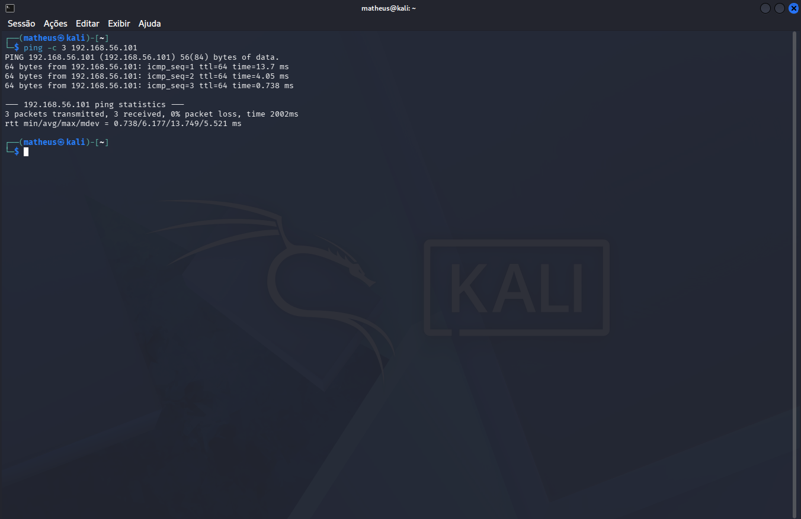
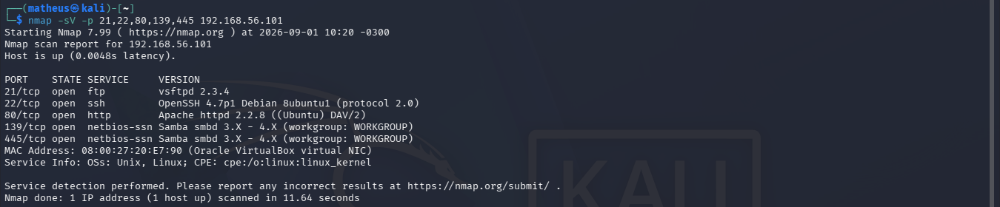
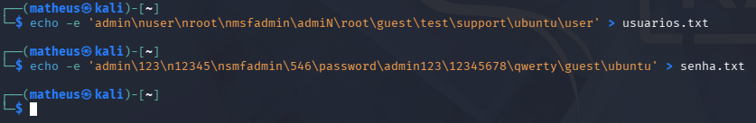
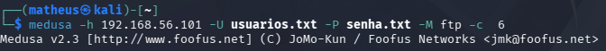
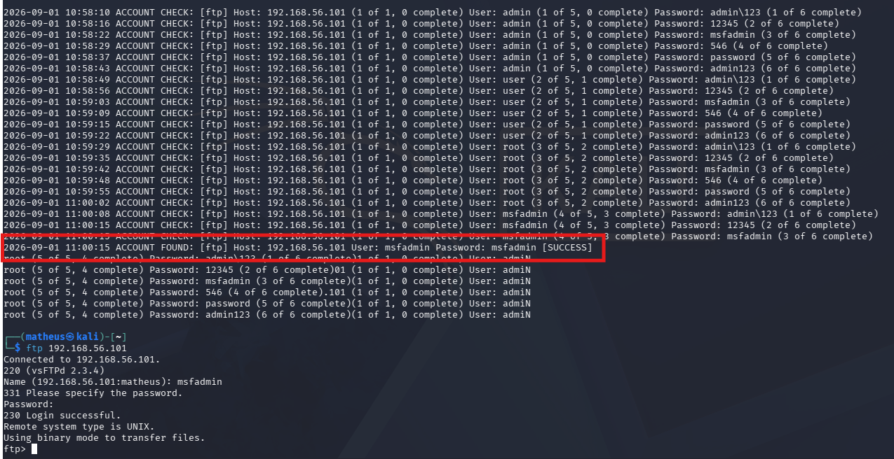

# Laboratório de Força Bruta com Medusa

<p align="center">
  
  
  
  
</p>

<p align="center">
  Laboratório educacional de cibersegurança utilizando Kali Linux, Nmap e Medusa para estudo de força bruta em ambiente controlado.
</p>

---

## Sobre o Projeto

Este projeto apresenta um laboratório prático de **força bruta de senhas** utilizando a ferramenta **Medusa** no **Kali Linux**.

O laboratório foi realizado em um ambiente controlado e autorizado, com foco em estudo, documentação de evidências e compreensão dos riscos relacionados ao uso de credenciais fracas.

O repositório contém evidências em imagem, wordlists, vídeo demonstrativo e relatório técnico do laboratório.

---

## Objetivo

O objetivo deste laboratório é demonstrar, de forma educacional, como funciona um teste de força bruta utilizando listas de usuários e senhas.

Também foram utilizadas etapas de reconhecimento e validação do ambiente antes da execução do teste.

---

## Ferramentas Utilizadas

| Ferramenta | Finalidade |
|---|---|
| Kali Linux | Ambiente utilizado para execução do laboratório |
| Ping | Verificação de conectividade com o alvo |
| Nmap | Reconhecimento e varredura de serviços |
| Medusa | Execução do teste de força bruta |
| Wordlists | Listas de usuários e senhas utilizadas no teste |

---

## Estrutura do Projeto

```text
laboratorio-forca-bruta-medusa/
│
├── evidencias/
│   ├── medusa.png
│   ├── nmap.png
│   ├── ping.png
│   ├── resultado.png
│   └── wordlists.png
│
├── video/
│   └── Simulação de Ataque de Força Bruta com Medusa.mp4
│
├── wordlists/
│   ├── password.txt
│   └── users.txt
│
├── Relatório de Pentest — Ataque de Força Bruta com Medusa.pdf
└── README.md
```

---

## Evidências

### Verificação de Conectividade

Evidência da verificação de comunicação com o ambiente de teste.



---

### Reconhecimento com Nmap

Evidência da etapa de reconhecimento e identificação de serviços disponíveis no ambiente.



---

### Wordlists Utilizadas

Evidência das listas de usuários e senhas utilizadas durante o laboratório.



---

### Execução do Medusa

Evidência da execução da ferramenta Medusa no Kali Linux.



---

### Resultado do Teste

Evidência do resultado obtido após a execução do teste de força bruta.



---

## Wordlists

As listas utilizadas no laboratório estão na pasta:

```text
wordlists/
```

Arquivos:

```text
wordlists/users.txt
wordlists/password.txt
```

Esses arquivos foram utilizados apenas para fins de estudo dentro de um ambiente controlado.

---

## Vídeo Demonstrativo

O vídeo demonstrativo do laboratório está disponível no YouTube:

[Assistir vídeo demonstrativo](https://youtu.be/7ah-nY60RG8)

O vídeo apresenta a simulação do laboratório de força bruta com Medusa, mostrando as etapas realizadas em ambiente controlado e autorizado.

---

## Relatório Técnico

O relatório completo do laboratório está disponível no arquivo abaixo:

[Ver relatório técnico](Relatório%20de%20Pentest%20—%20Ataque%20de%20Força%20Bruta%20com%20Medusa.pdf)

O relatório contém mais detalhes sobre o ambiente, metodologia, execução, evidências e conclusão do laboratório.

---

## Aviso de Uso Ético

Este projeto foi desenvolvido exclusivamente para fins educacionais.

Os testes foram realizados em ambiente controlado e autorizado. O uso de ferramentas como o Medusa em sistemas, redes ou serviços de terceiros sem permissão pode ser ilegal.

O objetivo deste laboratório é estudar segurança de senhas e reforçar boas práticas de proteção.

---

## Recomendações de Segurança

Algumas práticas importantes para reduzir riscos de ataques de força bruta:

- utilizar senhas fortes;
- evitar senhas padrão;
- aplicar autenticação multifator;
- limitar tentativas de login;
- monitorar logs de autenticação;
- bloquear acessos suspeitos;
- manter sistemas atualizados.

---

## Autor

Projeto desenvolvido por **Matheus Soares** para fins de estudo e prática em cibersegurança, com foco em Kali Linux, Nmap, Medusa, testes de força bruta, segurança de senhas e documentação de evidências.

---

## Uso Educacional

Este laboratório possui finalidade exclusivamente educacional e foi desenvolvido para estudo de cibersegurança em ambiente autorizado.
